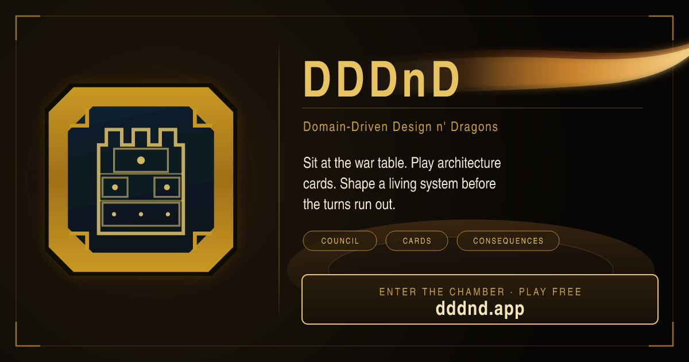

# DDDnD — Domain-Driven Design n' Dragons

**Play free:** [dddnd.app](https://dddnd.app) · **How to play & designer desk:** [docs site](https://mooeypoo.github.io/DDDnD/)

The dungeon is a living software system. The monsters are technical debt, organizational chaos, and a clock that does not care about your roadmap. You join the council as the systems architect and try to leave the system stronger than you found it — before the last turn.

DDDnD is a satirical strategy game about Domain-Driven Design under pressure. It is a full game, not a slide deck with hit points.

## The table

You sit at a war table. The system is the scene in the center. Stakeholders sit around it. You hold a **legal hand of six** architecture cards.

Each turn you either:

- **play one card** onto the table — a real architectural decision, or
- **Consult the Archives** and spend the turn replacing a card you do not want

The rest of the pack lives in the **Grimoire**. Look. Inspect. Do not play from the shelves. Searching is delay: aftershocks still land, a random event may still hit, and the council still speaks.

Yesterday's shortcut can arrive as today's crisis. Those are **aftershocks**. When a core score collapses, coupling binds the table and gains elsewhere wither. The people in the seats have their own agendas. Keep them, or face them.

Six vials track the system — not a seventh "satisfaction" meter. The council is the seats.

| Score | Short | What it is watching |
|---|---|---|
| Domain Clarity | Clarity | Whether the model still means something |
| Maintainability | Craft | Whether anyone can change the code on purpose |
| Delivery Confidence | Delivery | Whether you can still ship |
| Team Morale | Morale | Whether the humans are still here |
| User Trust | Trust | Whether anyone still believes the product |
| Budget | Purse | How much runway the architecture has left |

A run ends with a **tier** (how well you did) and an **ending** (what kind of architect the table remembers). Collapse through Triumph. There is no single correct path.

Five adventures, from a gentle merger mess to microservice sprawl. Two tutorials teach the table first. Pick a class if you like a lens — Boundary Mage, Stakeholder Bard, Reliability Cleric, Legacy Ranger, Delivery Rogue.

**[Play at dddnd.app](https://dddnd.app)** · **[Read How to Play](https://mooeypoo.github.io/DDDnD/guide/gameplay)**

## Built like the thing it teases

The joke is DDD. The implementation is also DDD.

Rules live in a deterministic **simulation** domain that does not import Vue, the DOM, or browser storage. The **UI** sits at the table and calls engine verbs (`create_run`, `get_turn_briefing`, `play_turn`, `consult_archives`). It does not resolve cards, pick events, or apply stakeholder rules. **Content** is versioned human-readable JSON packs. Same seed + same pack + same actions always produce the same run. That is how we audit fairness without guessing.

| Domain | Owns |
|---|---|
| content | Packs, manifests, `{ id, version }` refs, scenario bundles |
| simulation | Turn pipeline, seeded randomness, outcomes |
| persistence | Save / load / export |
| reporting | Summaries and share cards |
| ui | Chamber, hand, Grimoire, theater, `endingType` |

If you want to extend the game, you author a pack. You do not fork the Vue tree to change what a card does.

## Documentation map

The public site is two rooms: [How to Play](https://mooeypoo.github.io/DDDnD/guide/gameplay) for people who will sit, and the [Designer Desk](https://mooeypoo.github.io/DDDnD/dashboard/) for packs and audit numbers.

In this repo:

- [GAME_DESIGN.md](./GAME_DESIGN.md) — the live game, in design language
- [ARCHITECTURE.md](./ARCHITECTURE.md) — domain boundaries and the runtime bet
- [CONTENT_SCHEMA.md](./CONTENT_SCHEMA.md) and [CONTENT_VERSIONING.md](./CONTENT_VERSIONING.md) — how pack JSON is shaped and when a file must become `-v2`
- [docs/CONTENT_PACK_AUTHORING_GUIDE.md](./docs/CONTENT_PACK_AUTHORING_GUIDE.md) — writing and hosting packs
- [docs/CONTENT_FAIRNESS_AND_BALANCE_AUDIT_SPEC.md](./docs/CONTENT_FAIRNESS_AND_BALANCE_AUDIT_SPEC.md) — how we decide if a scenario is fair
- [docs/GAMEPLAY_V2.md](./docs/GAMEPLAY_V2.md) — journal of the war-table overhaul
- [AGENT.md](./AGENT.md) — where agents (and tired humans) start

## Contributing

Local setup, commands, content validation, and the audit gate live in [CONTRIBUTORS.md](./CONTRIBUTORS.md). Read [AGENT.md](./AGENT.md) and [ARCHITECTURE.md](./ARCHITECTURE.md) before changing rules or packs. Simulation stays UI-agnostic. New gameplay numbers get a new content version.

## Author

Moriel Schottlender ([GitHub](https://github.com/mooeypoo)) ([Website](https://moriel.tech)) ([Blog](https://blog.moriel.tech))

## License

GPL-3.0-only
